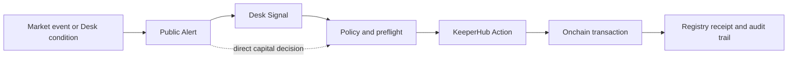
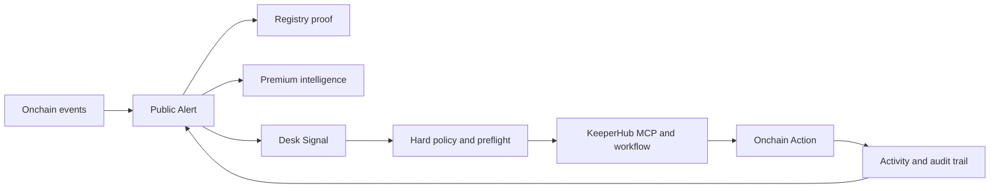
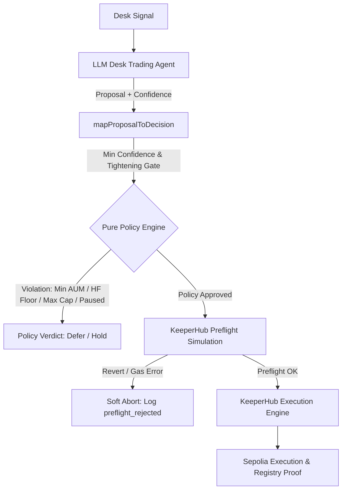
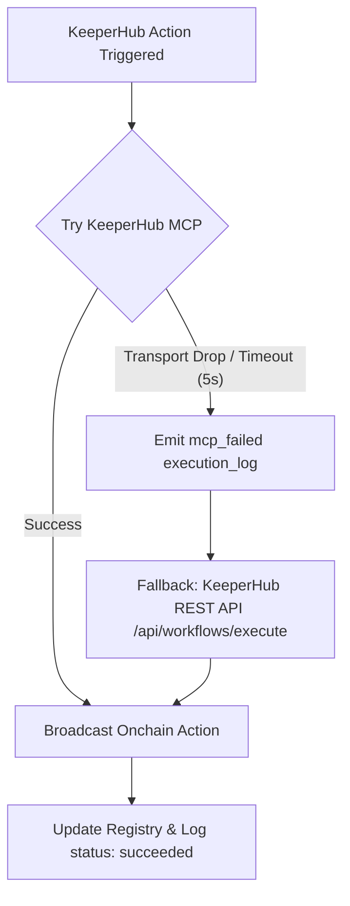
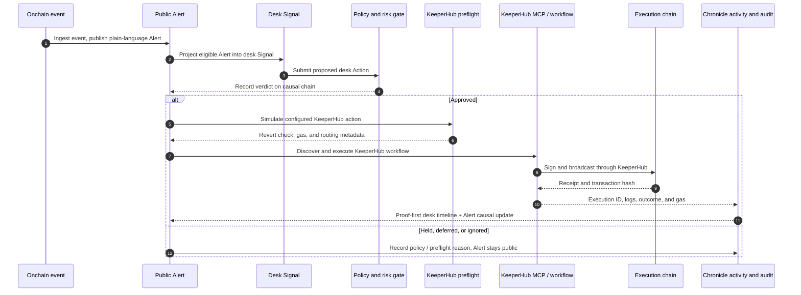

# ChronicleAI

> **The proof-first autonomous onchain response desk.**
>
> ChronicleAI publishes public Alerts from market events and Desk-native conditions, links eligible Alerts to Desk Signals when applicable, and converts policy-approved decisions into KeeperHub Actions with public proof.

[](https://keeperhub.com)
[](README.md#verification)
[](https://js.langchain.com/)
[](https://www.typescriptlang.org/)

## Demo first

ChronicleAI makes the response path inspectable end to end:

**Alert → Signal (optional) → Decision → Action → Proof**



- **Alert** is the public bulletin: market-event or desk-trigger, plain language, source, and publication proof.
- **Signal** is the desk input when applicable — projected from an eligible market Alert, or created from a Desk-native poll and linked back to a desk-trigger Alert. Direct capital decisions may omit this step.
- **Decision** is the policy verdict (`trade`, `defend`, `defer`) recorded on the Alert.
- **Action** is the policy-approved KeeperHub execution (intent / ticket / workflow run) when the decision is not deferred.
- **Proof** is the linked receipt, run ID, transaction hash, and activity trail.

Alerts originate from **market events** (external onchain observations) or **Desk state** (health-factor breaches, oracle/AMM dislocations, APY differentials, gas regimes, capital conditions). Not every Alert becomes a trade — some stay observation-only or deferred. An end-to-end path is only called verified when a real decision, intent/action, and transaction proof exist.

Premium feeds, sponsored watches, treasury routing, and affiliate payouts extend this loop but are not required to understand the core demo.

### The core demo

| Step | Surface | Judge should see |
| --- | --- | --- |
| 1 | [Live alerts](https://chronicle-ai-web.vercel.app/alerts) | Market and Desk-trigger Alerts with the causal chain (Signal optional for direct capital decisions). |
| 2 | [Chronicle Desk](https://chronicle-ai-web.vercel.app/desk) | The desk consuming Alert-backed Signals: proposal, policy decision, and preflight status. |
| 3 | [Agent Activity](https://chronicle-ai-web.vercel.app/activity) | KeeperHub execution logs, outcome, routing, and audit context for the Action. |
| 4 | [Example onchain proof](https://sepolia.etherscan.io/tx/0xf7c52b28894b6551bd4305085141ccca70898f969bd8ac589bf52c4bb0a3d0b6) | The transaction that anyone can verify independently. |

### Source vs execution chains

The unified Alerts feed includes **Mainnet market Alerts** and **Sepolia Desk-trigger Alerts**. Intelligence can be observed on **Ethereum Mainnet** (primary market source) while publication and desk execution run on **Ethereum Sepolia**. Alert cards label source chain and publication/execution chain separately so mainnet evidence is never confused with Sepolia fills.

## Full system overview

ChronicleAI is an autonomous onchain market desk with a public memory: it turns market activity into sourced Alerts and digests, offers premium machine-readable intelligence over x402/MPP, and can convert a policy-approved Alert-backed Signal into an auditable KeeperHub Action.

This is the distinction from a generic trading bot:

- It **publishes what it sees** as Alerts — both market events and Desk-native conditions — instead of keeping reasoning private.
- It **links Desk Signals to Alerts** — market Alerts project into Signals; Desk-native polls create desk-trigger Alerts and link back. Registry/publication failure never blocks a safe Desk action.
- It **monetizes deeper intelligence** instead of treating research as an invisible prompt.
- It **acts only after policy and preflight checks** instead of letting an LLM broadcast arbitrary calldata.
- It **proves what happened** with registry receipts, KeeperHub run IDs, transaction hashes, routing metadata, and an activity trail.

## Full system architecture: the last mile



The same intelligence can be read, paid for, acted on, and independently verified. KeeperHub owns the execution step; ChronicleAI owns the intelligence, Alert→Signal projection, policy, product experience, and proof layer around it.

## Judge links

| Requirement | Link |
| --- | --- |
| Source code | [github.com/zaikaman/ChronicleAI](https://github.com/zaikaman/ChronicleAI) |
| Live activity and execution proof | [chronicle-ai-web.vercel.app/activity](https://chronicle-ai-web.vercel.app/activity) |
| Live desk and audit timeline | [chronicle-ai-web.vercel.app/desk](https://chronicle-ai-web.vercel.app/desk) |
| Live alerts and causal chains | [chronicle-ai-web.vercel.app/alerts](https://chronicle-ai-web.vercel.app/alerts) |
| Registry contract | [`0xD8Deb4475a7E23E194Bc93f8739858Fb20744111`](https://sepolia.etherscan.io/address/0xD8Deb4475a7E23E194Bc93f8739858Fb20744111) |

## Supporting surfaces and capabilities

- **Public intelligence:** Alerts (market-event and desk-trigger), daily digests, trade tickets, capital-move records, and proof-of-publication receipts.
- **Alert → Signal projection:** [`apps/api/src/services/alert-to-signal-service.ts`](apps/api/src/services/alert-to-signal-service.ts) maps eligible market event types into desk signal types and records causal metadata on the Alert.
- **Desk-trigger Alerts:** [`apps/api/src/services/desk-trigger-alert-service.ts`](apps/api/src/services/desk-trigger-alert-service.ts) creates deterministic public Alerts from non-ignore Desk signals, capital decisions, and event-linked microtrades — no LLM copy, best-effort publication.
- **Premium intelligence & Dual-Rail Auto Selection:** HTTP 402 routing with x402/MPP adapters. Auto-selects MPP (Tempo HMAC) for machine/agent traffic (`X-Chronicle-Client: agent`, `clientType: machine`, `mpp-*`) and x402 (Base USDC) for human browser wallets (`0x...`).
- **Desk reasoning:** LangChainJS with provider fallback; the model proposes from Signals, while hard policy gates the Action.
- **KeeperHub execution:** configured workflows execute desk strategies, registry writes, transfers, and the kill switch. MCP is preferred; REST workflow execution remains a KeeperHub fallback.
- **Reliability layer:** preflight simulation, idempotency keys, private routing for material desk actions, gas and routing metadata, kill-switch controls, and structured outcome handling.
- **Operator UX:** public Activity, Alerts, Premium, and Desk views make the agent’s work inspectable instead of asking users to trust a black box.

## Deep proof set

The core demo uses one Alert→Signal→Action path. The repository includes 33 KeeperHub workflow definitions (28 core workflows and 5 optional mainnet monitoring workflows); the following proof set is available for deeper inspection:

| Surface / workflow | Action | Transaction |
| --- | --- | --- |
| Desk Oracle Arbitrage | Uniswap V3 swap via KeeperHub private route | [0xf7c52b28…0a3d0b6](https://sepolia.etherscan.io/tx/0xf7c52b28894b6551bd4305085141ccca70898f969bd8ac589bf52c4bb0a3d0b6) |
| Desk Yield Rotation | Uniswap LINK→USDC swap via KeeperHub | [0xa6ccb246…51279d2a](https://sepolia.etherscan.io/tx/0xa6ccb2467f04e4159a0219fba7a3de307a2e196487cc6242d80493b851279d2a) |
| Desk Treasury Sweep | Treasury transfer workflow | [0x47d1f3b9…4cebeeda](https://sepolia.etherscan.io/tx/0x47d1f3b90396e4fd63168f056d027cf0c9c8bd90949041f749bb249e4cebeeda) |
| Daily Digest | `ChronicleRegistry.publishDigest` | [0xe25efe40…38d204](https://sepolia.etherscan.io/tx/0xe25efe406b08c852aafdca4b990d02c480707fd0c814c0bca852c679ed38d204) |
| Intelligence Alert | `ChronicleRegistry.publishAlert` | [0x4acf30c4…bcc62f6a](https://sepolia.etherscan.io/tx/0x4acf30c4948dd0ddcde8c1377af22fc1c6acd01662b7470a785ae293bcc62f6a) |
| Desk Capital Top-up | `recordCapitalMove` workflow | [0x7aac47c6…f224bf](https://sepolia.etherscan.io/tx/0x7aac47c61d30b15a7cb381423731fbd61936e086c5e54402a7a3d54395f224bf) |
| Trade Ticket | `ChronicleRegistry.recordTradeTicket` | [0xaf1c821f…a1952](https://sepolia.etherscan.io/tx/0xaf1c821f6edbd78af9f6f63d0a982d311d5db05dc217db3787a61179ca4a1952) |
| Capital Move | `ChronicleRegistry.recordCapitalMove` | [0x254764d5…172c5](https://sepolia.etherscan.io/tx/0x254764d54457a753ad1e2ff6f3e9dec483bfcbdfa7f56a0630ddba0753b172c5) |
| x402 Premium Receipt | `transferWithAuthorization` → `recordPremiumReceipt` | Paid on Base: [0x19d45cdb…4a82](https://sepolia.basescan.org/tx/0x19d45cdbef7ab0ba260b823163fd988921b98ca3630c2899af5a1ca27f1e4a82) → Receipt on Sepolia: [0x9e109ac9…2d96](https://sepolia.etherscan.io/tx/0x9e109ac9caa345206c9fb863adcb5dfe9c966df8969b434af9c5f3f7f2c62d96) |
| MPP Premium Receipt | `recordPremiumReceipt` | [0xe5dd502b…529851](https://sepolia.etherscan.io/tx/0xe5dd502b509fbaecc5a6341130fdc104aa11a1b66b7af0d0386dcd436a529851) |
| Sponsored Watch | `createSponsoredWatch` | [0xcc5eb3b6…85b2](https://sepolia.etherscan.io/tx/0xcc5eb3b64e1ceb743e99a98525707b3594c36dfec91f1bbb497b2a4e64d785b2) |
| Sponsored Report | `publishSponsoredReport` | [0x92d63e8b…bdf7](https://sepolia.etherscan.io/tx/0x92d63e8b3912e6fc57b19637cbbb158d20fce8e801997bce6a0489c68846bdf7) |
| Affiliate Payout | `recordAffiliatePayout` | [0xd4739e92…d7fc](https://sepolia.etherscan.io/tx/0xd4739e92b6ae88f61d06c63cd10e22794da86f058356484f7decced41af2d7fc) |

## KeeperHub integration

| Surface | Implementation | What it contributes |
| --- | --- | --- |
| Workflow execution | [`apps/api/src/desk/execution-bridge.ts`](apps/api/src/desk/execution-bridge.ts) and [`apps/api/src/services/keeperhub-write-client.ts`](apps/api/src/services/keeperhub-write-client.ts) | Workflow-only production writes, idempotency, polling, transaction receipts, and a KeeperHub REST fallback. |
| MCP server | [`apps/api/src/services/keeperhub-mcp-execute.ts`](apps/api/src/services/keeperhub-mcp-execute.ts) and [`apps/api/src/agents/langchain/keeperhub-mcp-publication-agent.ts`](apps/api/src/agents/langchain/keeperhub-mcp-publication-agent.ts) | `list_workflows → get_workflow → execute_workflow → get_execution`; native LangChain ReAct for publication, deterministic MCP fallback when the model is unavailable. |
| Smart gas and preflight | [`apps/api/src/desk/kh-simulate-preflight.ts`](apps/api/src/desk/kh-simulate-preflight.ts) | Dry-run validation before material desk writes; failed or uncertain preflight is recorded rather than presented as a fill. |
| Private routing | [`apps/api/src/services/keeperhub-private-capability.ts`](apps/api/src/services/keeperhub-private-capability.ts) and [`apps/api/src/services/routing-metadata.ts`](apps/api/src/services/routing-metadata.ts) | Strict private routing for desk and kill-switch actions, with honest public/sponsored routing for registry writes. |
| Dual-Rail Auto Selection | [`apps/api/src/services/payment-challenge-service.ts`](apps/api/src/services/payment-challenge-service.ts) | Auto-selects MPP for AI agents (`X-Chronicle-Client: agent`, `clientType: machine`, `mpp-*`) and x402 for human browser wallets (`0x...`) on challenge creation. |
| x402 / MPP Adapters | [`apps/api/src/payments/x402-payment-adapter.ts`](apps/api/src/payments/x402-payment-adapter.ts) and [`apps/api/src/payments/mpp-payment-adapter.ts`](apps/api/src/payments/mpp-payment-adapter.ts) | Dual-protocol premium intelligence access and onchain receipt anchoring. |
| Audit trail | [`apps/api/src/desk/execution-audit.ts`](apps/api/src/desk/execution-audit.ts) and [`apps/web/src/features/desk/ExecutionAuditTimeline.tsx`](apps/web/src/features/desk/ExecutionAuditTimeline.tsx) | Correlates policy/preflight, KeeperHub run logs, final receipts, gas, routing, and failure narratives. |
| Alert → Signal | [`apps/api/src/services/alert-to-signal-service.ts`](apps/api/src/services/alert-to-signal-service.ts) | Projects eligible public Alerts into desk Signals and writes causal metadata back onto the Alert. |
| Desk-trigger Alerts | [`apps/api/src/services/desk-trigger-alert-service.ts`](apps/api/src/services/desk-trigger-alert-service.ts) | Deterministic public desk_trigger Alerts from non-ignore signals, capital decisions, and event microtrades. |

### Execution routing policy

| Transaction class | Route | Gas / status label |
| --- | --- | --- |
| Desk strategies (`oracle_arb`, `rotate_yield`, …) | KeeperHub private workflow | Wallet gas; **Private route** |
| Kill-switch residual | KeeperHub private workflow, strict | Wallet gas; **Private route** |
| Treasury / revenue transfer | KeeperHub public workflow when configured | Wallet gas; **Public route** |
| Registry alerts, digests, receipts, sponsored watches | KeeperHub public workflow | Sponsorship preferred; **Public (Sponsorship requested)** |

Private routing and gas sponsorship are mutually exclusive on the same transaction. ChronicleAI records which route was requested and which outcome was actually returned; it does not label a transaction “MEV-proof” or “sponsored” without evidence.

## Reliability and observability

- **Policy gate:** the LLM proposes a strategy from a Desk Signal; hard limits, position caps, minimum AUM, pause state, and kill-switch state decide whether it can execute.
- **Preflight:** a KeeperHub dry-run is captured before the live workflow when configured.
- **Fail-closed private path:** a strict private route does not silently become a public desk trade. An explicitly configured public fallback is recorded as a different route.
- **Idempotency:** execution keys and content hashes prevent duplicate registry publications and repeated capital actions.
- **Terminal-state correctness:** `completed: true` is not treated as success when KeeperHub returns an error or failed node.
- **Three-layer audit:** policy/preflight, KeeperHub execution logs, and final onchain receipt are correlated into one desk timeline.
- **Causal Alert metadata:** signal status (optional for direct capital decisions), policy verdict, action status, ticket, and transaction stay linked on the originating Alert.
- **No invented fills:** a run without a real transaction hash remains pending, unknown, failed, or timed out.
- **Kill switch:** missed heartbeats and failed safety conditions pause the desk and route residual defense through the dedicated kill-switch workflow.

### Safety Model & Authority Separation

ChronicleAI strictly separates decision authority from execution infrastructure. Language-model reasoning is treated as an **advisory-only proposal generator**, while a pure deterministic policy engine owns all execution gating and risk boundaries.



#### Key Invariants & Safeguards
1. **Authority Separation:** The LLM schema (`DeskAgentProposal`) cannot self-approve actions. Deterministic rules in [`apps/api/src/desk/policy-engine.ts`](apps/api/src/desk/policy-engine.ts) own Health Factor floors (`hfWarn`), position size caps (`maxTradeUsdc`), AUM equity floors, single-flight locks, and kill-switch states.
2. **Tightening-Only Advisory:** Proposals below minimum confidence threshold are monotonically converted to `hold` via `applyMinConfidence` in [`apps/api/src/desk/agent/map-proposal.ts`](apps/api/src/desk/agent/map-proposal.ts). An LLM proposal can defer execution or reduce spend, but can **never** turn a deterministic policy denial into an onchain execution. Critical Health Factor breaches trigger `applyForceDefendOverride`, forcing risk defense regardless of LLM output.
3. **Preflight Dry-Run:** Every state-changing KeeperHub workflow is dry-run simulated via [`apps/api/src/desk/kh-simulate-preflight.ts`](apps/api/src/desk/kh-simulate-preflight.ts) prior to broadcast. Reverting or unviable trades abort cleanly without burning gas.
4. **Failure Classification & Idempotency:** Executions are classified (`FailureClassifier`) across gas, revert, nonce, RPC, and unknown errors. Confirmed onchain writes are never retried.
5. **Canonical Receipts & Audit Ledger:** `ChronicleRegistry` anchors the canonical content hash, URI, tx hash, and KeeperHub run ID onchain, cross-referenced in public Activity logs.

### Documented Failure & Recovery Case Study: MCP Transport Disconnect → REST API Fallback

Judges evaluating reliability can inspect how ChronicleAI closes the observability loop when KeeperHub execution encounters transport failures.



#### Narrative & Recovery Sequence
1. **Trigger / Action:** ChronicleAI attempts to publish a verified Alert to the `ChronicleRegistry` contract (`publishAlert`).
2. **Primary Execution Path (MCP):** The agent initiates workflow `m4q4c63ixjoqvjq705116` via KeeperHub MCP Model Context Protocol (`mcp_url: https://app.keeperhub.com/mcp`).
3. **Failure Detected:** The MCP WebSocket/transport socket closes unexpectedly or times out (5000ms limit).
4. **Resilience & Fallback:** `softAppendExecutionLog` records the `mcp_failed` event, and [`apps/api/src/services/keeperhub-write-client.ts`](apps/api/src/services/keeperhub-write-client.ts) transparently switches execution to the KeeperHub REST API endpoint (`/api/workflows/execute`).
5. **Recovery Outcome:** The REST API workflow completes successfully (`status: succeeded`), broadcasting Sepolia tx `0xdeaf6568beed23962733d93e5575d2d8b182ee2d5f691609bb137a5f36166956`. Zero transaction dropped, zero duplicate registry writes.

#### Production Execution Log Audit Trail (`execution_logs`)

```json
[
  {
    "action_type": "registry_write",
    "entity_type": "keeperhub_workflow",
    "status": "failed",
    "message": "KeeperHub MCP execution failed: socket closed (timeout 5000ms); attempting REST API fallback",
    "details": {
      "method": "publishAlert",
      "workflowId": "m4q4c63ixjoqvjq705116",
      "executionPath": "mcp",
      "mcp_url": "https://app.keeperhub.com/mcp",
      "error": "MCP transport timeout",
      "fallbackTriggered": true
    },
    "created_at": "2026-08-03T15:34:08.120Z"
  },
  {
    "action_type": "registry_write",
    "entity_type": "keeperhub_workflow",
    "status": "succeeded",
    "message": "KeeperHub publishAlert succeeded (via REST fallback)",
    "details": {
      "method": "publishAlert",
      "chainId": 11155111,
      "workflowId": "m4q4c63ixjoqvjq705116",
      "executionPath": "rest_fallback",
      "executedViaKeeperHub": true,
      "keeper_hub_run_id": "mrxecw9jaurr4y6ma5mh6",
      "tx_hash": "0xdeaf6568beed23962733d93e5575d2d8b182ee2d5f691609bb137a5f36166956",
      "explorer_url": "https://sepolia.etherscan.io/tx/0xdeaf6568beed23962733d93e5575d2d8b182ee2d5f691609bb137a5f36166956"
    },
    "created_at": "2026-08-03T15:34:53.519Z"
  }
]
```

## Architecture



## Repository map

| Component | Source |
| --- | --- |
| Alert → Signal projection | [`apps/api/src/services/alert-to-signal-service.ts`](apps/api/src/services/alert-to-signal-service.ts) |
| Desk-trigger Alert service | [`apps/api/src/services/desk-trigger-alert-service.ts`](apps/api/src/services/desk-trigger-alert-service.ts) |
| Desk execution bridge | [`apps/api/src/desk/execution-bridge.ts`](apps/api/src/desk/execution-bridge.ts) |
| Desk trading agent | [`apps/api/src/desk/agent/desk-trading-agent.ts`](apps/api/src/desk/agent/desk-trading-agent.ts) |
| Desk signal engine | [`apps/api/src/desk/signal-engine.ts`](apps/api/src/desk/signal-engine.ts) |
| Policy and control plane | [`apps/api/src/desk/control-plane.ts`](apps/api/src/desk/control-plane.ts) |
| KeeperHub MCP client | [`apps/api/src/services/keeperhub-mcp-client.ts`](apps/api/src/services/keeperhub-mcp-client.ts) |
| Deterministic MCP execution | [`apps/api/src/services/keeperhub-mcp-execute.ts`](apps/api/src/services/keeperhub-mcp-execute.ts) |
| KeeperHub write facade | [`apps/api/src/services/keeperhub-write-client.ts`](apps/api/src/services/keeperhub-write-client.ts) |
| Preflight simulator | [`apps/api/src/desk/kh-simulate-preflight.ts`](apps/api/src/desk/kh-simulate-preflight.ts) |
| Execution audit | [`apps/api/src/desk/execution-audit.ts`](apps/api/src/desk/execution-audit.ts) |
| CCTP treasury worker | [`apps/api/src/cctp/rebalance-service.ts`](apps/api/src/cctp/rebalance-service.ts) |
| Activity UI | [`apps/web/src/features/activity/ActivityPage.tsx`](apps/web/src/features/activity/ActivityPage.tsx) |
| Alerts UI + causal chain | [`apps/web/src/features/alerts/AlertCard.tsx`](apps/web/src/features/alerts/AlertCard.tsx) |
| Desk UI | [`apps/web/src/features/desk/DeskStatusPage.tsx`](apps/web/src/features/desk/DeskStatusPage.tsx) |
| Premium UI | [`apps/web/src/features/premium/PremiumPage.tsx`](apps/web/src/features/premium/PremiumPage.tsx) |
| KeeperHub workflows | [`workflows/keeperhub/`](workflows/keeperhub) |

## Prerequisites

- Node.js `v22.x`
- pnpm `v10.7.1`
- Supabase CLI for local database migrations and generated types

## Configuration

Copy the API example environment file:

```bash
cp apps/api/.env.example apps/api/.env
```

The minimum hackathon path needs KeeperHub, network, and model configuration:

```env
KEEPERHUB_API_KEY=kh_live_...
KEEPERHUB_API_BASE_URL=https://app.keeperhub.com
KEEPERHUB_MCP_ENABLED=true
KEEPERHUB_MCP_URL=https://mcp.keeperhub.com/sse

DESK_USE_PRIVATE_MEMPOOL=true
DESK_PRIVATE_MEMPOOL_STRICT=true
REGISTRY_USE_PRIVATE_MEMPOOL=false

GROQ_API_KEY=gsk_...
OPENAI_API_KEY=sk_...

RPC_URL=https://sepolia.infura.io/v3/...
X402_RPC_URL=https://sepolia.base.org
DESK_WALLET_ADDRESS=0x...
```

Import the workflow JSON definitions into KeeperHub and set the corresponding `KEEPERHUB_WORKFLOW_*` variables before attempting live writes. The bridge fails hard when a required workflow ID is absent.

## Running ChronicleAI

```bash
pnpm install
pnpm --filter @chronicleai/api exec tsx scripts/keeperhub-stack-smoke.ts
pnpm dev
```

The local services run at:

- Web frontend: `http://localhost:5173`
- API server: `http://localhost:3000`

## Verification

The project reports **1,101 passing and 42 skipped tests** across 136 test files, plus 33 KeeperHub workflow definitions.

```bash
pnpm type-check
pnpm test
```

The smoke test checks environment configuration, MCP discovery, private-routing policy, audit visibility, and payment-surface configuration:

```bash
pnpm --filter @chronicleai/api exec tsx scripts/keeperhub-stack-smoke.ts
```

## License and acknowledgments

Built for **The Last Mile: KeeperHub AI Agent Hackathon 2026**.

- Execution and reliability layer: [KeeperHub](https://keeperhub.com)
- Agent framework: [LangChainJS](https://js.langchain.com/)
- Cross-chain treasury support: [Circle CCTP](https://www.circle.com/en/cross-chain-transfer-protocol)
- MPC custody support: [Para](https://getpara.com/)
