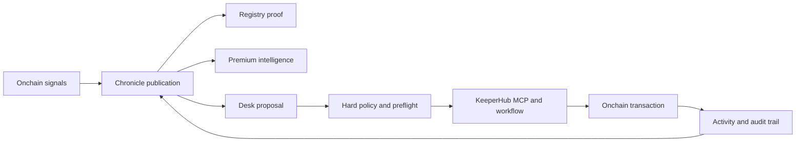
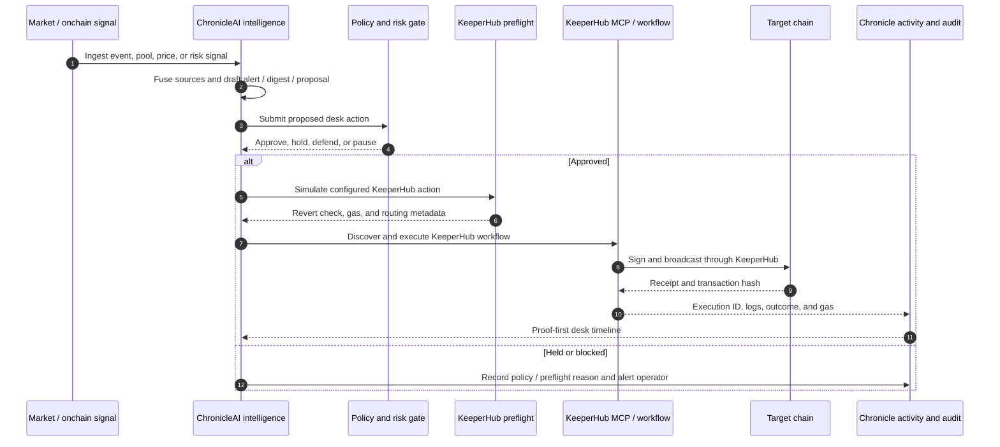

# ChronicleAI

> **The proof-first autonomous crypto intelligence desk.**
>
> ChronicleAI observes onchain markets, publishes verifiable intelligence, sells deeper analysis, and—when policy allows—acts on that intelligence through KeeperHub.

[](https://keeperhub.com)
[](README.md#verification)
[](https://js.langchain.com/)
[](https://www.typescriptlang.org/)

## The product in one sentence

ChronicleAI is an autonomous onchain market desk with a public memory: it turns market signals into sourced alerts and digests, offers premium machine-readable intelligence over x402/MPP, and can convert a policy-approved insight into an auditable KeeperHub execution.

This is the distinction from a generic trading bot:

- It **publishes what it sees** instead of keeping reasoning private.
- It **monetizes deeper intelligence** instead of treating research as an invisible prompt.
- It **acts only after policy and preflight checks** instead of letting an LLM broadcast arbitrary calldata.
- It **proves what happened** with registry receipts, KeeperHub run IDs, transaction hashes, routing metadata, and an activity trail.

## The Last Mile, end to end



The same intelligence can be read, paid for, acted on, and independently verified. KeeperHub owns the execution step; ChronicleAI owns the intelligence, policy, product experience, and proof layer around it.

## Judge in 30 seconds

| Requirement | Link |
| --- | --- |
| Source code | [github.com/zaikaman/ChronicleAI](https://github.com/zaikaman/ChronicleAI) |
| Live activity and execution proof | [chronicle-ai-web.vercel.app/activity](https://chronicle-ai-web.vercel.app/activity) |
| Live desk and audit timeline | [chronicle-ai-web.vercel.app/desk](https://chronicle-ai-web.vercel.app/desk) |
| Registry contract | [`0xD8Deb4475a7E23E194Bc93f8739858Fb20744111`](https://sepolia.etherscan.io/address/0xD8Deb4475a7E23E194Bc93f8739858Fb20744111) |
| Demo video | **Add the recorded demo URL here before submission.** |

The shortest useful demo is:

1. Open a Chronicle alert or desk signal.
2. Show the agent’s proposal and hard policy decision.
3. Show KeeperHub MCP/workflow discovery, execution, and polling.
4. Open the resulting explorer transaction.
5. Return to the Activity page and show the audit spine: preflight → KeeperHub run → receipt.

The video should use a registry publication or desk trade whose write path is unambiguously KeeperHub-backed. CCTP is a supporting treasury feature and is documented separately below.

## What is actually running

- **Public intelligence:** alerts, daily digests, trade tickets, capital-move records, and proof-of-publication receipts.
- **Premium intelligence:** HTTP 402 routing with x402/MPP adapters for machine-readable feeds and paid analysis.
- **Desk reasoning:** LangChainJS with provider fallback; the model proposes, while hard policy gates the action.
- **KeeperHub execution:** configured workflows execute desk strategies, registry writes, transfers, and the kill switch. MCP is preferred; REST workflow execution remains a KeeperHub fallback.
- **Reliability layer:** preflight simulation, idempotency keys, private routing for material desk actions, gas and routing metadata, kill-switch controls, and structured outcome handling.
- **Operator UX:** public Activity, Alerts, Premium, and Desk views make the agent’s work inspectable instead of asking users to trust a black box.

## Verified KeeperHub execution proof

The repository includes 33 KeeperHub workflow definitions: 28 core workflows and 5 optional mainnet monitoring workflows. The following are the clean KeeperHub-backed proof set currently linked from the project:

| Surface / workflow | Action | Transaction |
| --- | --- | --- |
| Desk Oracle Arbitrage | Uniswap V3 swap via KeeperHub private route | [0xf7c52b28…0a3d0b6](https://sepolia.etherscan.io/tx/0xf7c52b28894b6551bd4305085141ccca70898f969bd8ac589bf52c4bb0a3d0b6) |
| Desk Yield Rotation | Aave V3 supply via KeeperHub | [0x5a17e7b5…3ec0cc61](https://sepolia.etherscan.io/tx/0x5a17e7b561bceb585faa45ff05f0bdabe18e216e1b40f67525cc47cf3ec0cc61) |
| Desk Treasury Sweep | Treasury transfer workflow | [0x47d1f3b9…4cebeeda](https://sepolia.etherscan.io/tx/0x47d1f3b90396e4fd63168f056d027cf0c9c8bd90949041f749bb249e4cebeeda) |
| Daily Digest | `ChronicleRegistry.publishDigest` | [0xe25efe40…38d204](https://sepolia.etherscan.io/tx/0xe25efe406b08c852aafdca4b990d02c480707fd0c814c0bca852c679ed38d204) |
| Intelligence Alert | `ChronicleRegistry.publishAlert` | [0x1d72ba01…b23cb7](https://sepolia.etherscan.io/tx/0x1d72ba017d1c47ea8d2b4420c044c541b9a8d068c4740b709a9a84ef12b23cb7) |
| Desk Capital Top-up | `recordCapitalMove` workflow | [0x7aac47c6…f224bf](https://sepolia.etherscan.io/tx/0x7aac47c61d30b15a7cb381423731fbd61936e086c5e54402a7a3d54395f224bf) |
| Trade Ticket | `ChronicleRegistry.recordTradeTicket` | [0xaf1c821f…a1952](https://sepolia.etherscan.io/tx/0xaf1c821f6edbd78af9f6f63d0a982d311d5db05dc217db3787a61179ca4a1952) |
| Capital Move | `ChronicleRegistry.recordCapitalMove` | [0x3eeaa9ab…fe87](https://sepolia.etherscan.io/tx/0x3eeaa9aba8aa21eb5f3b7ef387b82d66182a2d62d044ea64687f1c4841c5fe87) |
| x402 Premium Receipt | `recordPremiumReceipt` | [0x9e109ac9…2d96](https://sepolia.etherscan.io/tx/0x9e109ac9caa345206c9fb863adcb5dfe9c966df8969b434af9c5f3f7f2c62d96) |
| MPP Premium Receipt | `recordPremiumReceipt` | [0x881691e5…be4b](https://sepolia.etherscan.io/tx/0x881691e5ce03e68524ab6ce2e4d2519d051ddc77438eb79240985ac76393be4b) |
| Sponsored Watch | `createSponsoredWatch` | [0xcc5eb3b6…85b2](https://sepolia.etherscan.io/tx/0xcc5eb3b64e1ceb743e99a98525707b3594c36dfec91f1bbb497b2a4e64d785b2) |
| Sponsored Report | `publishSponsoredReport` | [0x92d63e8b…bdf7](https://sepolia.etherscan.io/tx/0x92d63e8b3912e6fc57b19637cbbb158d20fce8e801997bce6a0489c68846bdf7) |
| Affiliate Payout | `recordAffiliatePayout` | [0xd4739e92…d7fc](https://sepolia.etherscan.io/tx/0xd4739e92b6ae88f61d06c63cd10e22794da86f058356484f7decced41af2d7fc) |

### Supporting CCTP proof

ChronicleAI also has a Circle CCTP liquidity-starvation worker. Its current implementation uses a Para MPC or legacy operator executor in [`apps/api/src/cctp/`](apps/api/src/cctp/), not the KeeperHub workflow bridge. These transactions are real supporting treasury proofs, but they are deliberately **not counted** in the KeeperHub-backed table above.

- [CCTP burn: Base Sepolia](https://sepolia.basescan.org/tx/0xb30984def5e87dbcf3968e30972229f1e9109afbe39338e375f8c4de7c67cec4)
- [CCTP mint: Ethereum Sepolia](https://sepolia.etherscan.io/tx/0xfeb8f1e45c61abc4bd5c0d94b9073b1447687b15469ad1171833dc0855c4497c)

This separation keeps the hackathon claim precise: the demonstrated desk and registry execution path goes through KeeperHub; CCTP is an adjacent treasury backend.

## KeeperHub integration

| Surface | Implementation | What it contributes |
| --- | --- | --- |
| Workflow execution | [`apps/api/src/desk/execution-bridge.ts`](apps/api/src/desk/execution-bridge.ts) and [`apps/api/src/services/keeperhub-write-client.ts`](apps/api/src/services/keeperhub-write-client.ts) | Workflow-only production writes, idempotency, polling, transaction receipts, and a KeeperHub REST fallback. |
| MCP server | [`apps/api/src/services/keeperhub-mcp-execute.ts`](apps/api/src/services/keeperhub-mcp-execute.ts) and [`apps/api/src/agents/langchain/keeperhub-mcp-publication-agent.ts`](apps/api/src/agents/langchain/keeperhub-mcp-publication-agent.ts) | `list_workflows → get_workflow → execute_workflow → get_execution`; native LangChain ReAct for publication, deterministic MCP fallback when the model is unavailable. |
| Smart gas and preflight | [`apps/api/src/desk/kh-simulate-preflight.ts`](apps/api/src/desk/kh-simulate-preflight.ts) | Dry-run validation before material desk writes; failed or uncertain preflight is recorded rather than presented as a fill. |
| Private routing | [`apps/api/src/services/keeperhub-private-capability.ts`](apps/api/src/services/keeperhub-private-capability.ts) and [`apps/api/src/services/routing-metadata.ts`](apps/api/src/services/routing-metadata.ts) | Strict private routing for desk and kill-switch actions, with honest public/sponsored routing for registry writes. |
| x402 / MPP | [`apps/api/src/payments/x402-payment-adapter.ts`](apps/api/src/payments/x402-payment-adapter.ts) and [`apps/api/src/payments/mpp-payment-adapter.ts`](apps/api/src/payments/mpp-payment-adapter.ts) | Dual-protocol premium intelligence access and onchain receipt anchoring. |
| Audit trail | [`apps/api/src/desk/execution-audit.ts`](apps/api/src/desk/execution-audit.ts) and [`apps/web/src/features/desk/ExecutionAuditTimeline.tsx`](apps/web/src/features/desk/ExecutionAuditTimeline.tsx) | Correlates policy/preflight, KeeperHub run logs, final receipts, gas, routing, and failure narratives. |

### Execution routing policy

| Transaction class | Route | Gas / status label |
| --- | --- | --- |
| Desk strategies (`oracle_arb`, `rotate_yield`, …) | KeeperHub private workflow | Wallet gas; **Private route** |
| Kill-switch residual | KeeperHub private workflow, strict | Wallet gas; **Private route** |
| Treasury / revenue transfer | KeeperHub public workflow when configured | Wallet gas; **Public route** |
| Registry alerts, digests, receipts, sponsored watches | KeeperHub public workflow | Sponsorship preferred; **Public (Sponsorship requested)** |

Private routing and gas sponsorship are mutually exclusive on the same transaction. ChronicleAI records which route was requested and which outcome was actually returned; it does not label a transaction “MEV-proof” or “sponsored” without evidence.

## Reliability and observability

- **Policy gate:** the LLM proposes a strategy; hard limits, position caps, minimum AUM, pause state, and kill-switch state decide whether it can execute.
- **Preflight:** a KeeperHub dry-run is captured before the live workflow when configured.
- **Fail-closed private path:** a strict private route does not silently become a public desk trade. An explicitly configured public fallback is recorded as a different route.
- **Idempotency:** execution keys and content hashes prevent duplicate registry publications and repeated capital actions.
- **Terminal-state correctness:** `completed: true` is not treated as success when KeeperHub returns an error or failed node.
- **Three-layer audit:** policy/preflight, KeeperHub execution logs, and final onchain receipt are correlated into one desk timeline.
- **No invented fills:** a run without a real transaction hash remains pending, unknown, failed, or timed out.
- **Kill switch:** missed heartbeats and failed safety conditions pause the desk and route residual defense through the dedicated kill-switch workflow.

## Demo script

The best 90-second cut is a single intelligence-to-action loop:

| Time | Show | Message |
| --- | --- | --- |
| 0:00–0:10 | Chronicle alert or digest with source and registry proof | “ChronicleAI publishes what it sees.” |
| 0:10–0:25 | Desk ticket with signal, proposal, position limits, and policy result | “The model proposes; policy decides.” |
| 0:25–0:45 | KeeperHub MCP/workflow discovery and `execute_workflow` call | “The agent does not broadcast directly.” |
| 0:45–1:05 | KeeperHub execution ID, preflight result, route badge, and polling | “KeeperHub handles the last mile.” |
| 1:05–1:20 | Explorer transaction and Activity page | “The action actually landed onchain.” |
| 1:20–1:30 | Audit timeline: policy → submit → outcome | “Every step is inspectable afterward.” |

Premium payments, sponsored watches, affiliate payouts, and CCTP are supporting proof points. They should reinforce the same story, not compete with the primary desk flow.

## Architecture



## Honest execution boundaries

The hackathon demo and the primary desk/registry product path use KeeperHub workflows. The repository also contains compatibility paths that should not be confused with that claim:

- The CCTP rebalance worker signs through Para MPC or a legacy operator executor.
- Some treasury code contains Para-backed compatibility behavior when a specific KeeperHub transfer workflow is unavailable.
- Direct EOA writes are gated for local/test compatibility and are disabled in production.

The production web3 factory requires KeeperHub for registry configuration, and the desk execution bridge explicitly rejects missing workflow IDs. The demo should use the KeeperHub-backed desk or registry routes and label adjacent treasury infrastructure accurately.

## Repository map

| Component | Source |
| --- | --- |
| Desk execution bridge | [`apps/api/src/desk/execution-bridge.ts`](apps/api/src/desk/execution-bridge.ts) |
| Desk trading agent | [`apps/api/src/desk/agent/desk-trading-agent.ts`](apps/api/src/desk/agent/desk-trading-agent.ts) |
| Policy and control plane | [`apps/api/src/desk/control-plane.ts`](apps/api/src/desk/control-plane.ts) |
| KeeperHub MCP client | [`apps/api/src/services/keeperhub-mcp-client.ts`](apps/api/src/services/keeperhub-mcp-client.ts) |
| Deterministic MCP execution | [`apps/api/src/services/keeperhub-mcp-execute.ts`](apps/api/src/services/keeperhub-mcp-execute.ts) |
| KeeperHub write facade | [`apps/api/src/services/keeperhub-write-client.ts`](apps/api/src/services/keeperhub-write-client.ts) |
| Preflight simulator | [`apps/api/src/desk/kh-simulate-preflight.ts`](apps/api/src/desk/kh-simulate-preflight.ts) |
| Execution audit | [`apps/api/src/desk/execution-audit.ts`](apps/api/src/desk/execution-audit.ts) |
| CCTP treasury worker | [`apps/api/src/cctp/rebalance-service.ts`](apps/api/src/cctp/rebalance-service.ts) |
| Activity UI | [`apps/web/src/features/activity/ActivityPage.tsx`](apps/web/src/features/activity/ActivityPage.tsx) |
| Desk UI | [`apps/web/src/features/desk/DeskStatusPage.tsx`](apps/web/src/features/desk/DeskStatusPage.tsx) |
| Premium UI | [`apps/web/src/features/premium/PremiumPage.tsx`](apps/web/src/features/premium/PremiumPage.tsx) |
| KeeperHub workflows | [`workflows/keeperhub/`](workflows/keeperhub) |

## Prerequisites

- Node.js `v22.x`
- pnpm `v10.7.1`
- Supabase CLI for local database migrations and generated types

## Configuration

Copy the API example environment file:

```bash
cp apps/api/.env.example apps/api/.env
```

The minimum hackathon path needs KeeperHub, network, and model configuration:

```env
KEEPERHUB_API_KEY=kh_live_...
KEEPERHUB_API_BASE_URL=https://app.keeperhub.com
KEEPERHUB_MCP_ENABLED=true
KEEPERHUB_MCP_URL=https://mcp.keeperhub.com/sse

DESK_USE_PRIVATE_MEMPOOL=true
DESK_PRIVATE_MEMPOOL_STRICT=true
REGISTRY_USE_PRIVATE_MEMPOOL=false

GROQ_API_KEY=gsk_...
OPENAI_API_KEY=sk_...

RPC_URL=https://sepolia.infura.io/v3/...
X402_RPC_URL=https://sepolia.base.org
DESK_WALLET_ADDRESS=0x...
```

Import the workflow JSON definitions into KeeperHub and set the corresponding `KEEPERHUB_WORKFLOW_*` variables before attempting live writes. The bridge fails hard when a required workflow ID is absent.

## Running ChronicleAI

```bash
pnpm install
pnpm --filter @chronicleai/api exec tsx scripts/keeperhub-stack-smoke.ts
pnpm dev
```

The local services run at:

- Web frontend: `http://localhost:5173`
- API server: `http://localhost:3000`

## Verification

The project reports **1,054 passing and 42 skipped tests** across 132 test files, plus 33 KeeperHub workflow definitions.

```bash
pnpm type-check
pnpm test
```

The smoke test checks environment configuration, MCP discovery, private-routing policy, audit visibility, and payment-surface configuration:

```bash
pnpm --filter @chronicleai/api exec tsx scripts/keeperhub-stack-smoke.ts
```

## License and acknowledgments

Built for **The Last Mile: KeeperHub AI Agent Hackathon 2026**.

- Execution and reliability layer: [KeeperHub](https://keeperhub.com)
- Agent framework: [LangChainJS](https://js.langchain.com/)
- Cross-chain treasury support: [Circle CCTP](https://www.circle.com/en/cross-chain-transfer-protocol)
- MPC custody support: [Para](https://getpara.com/)
