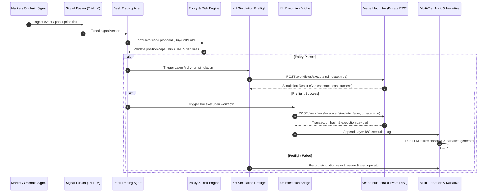
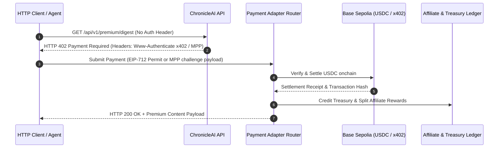
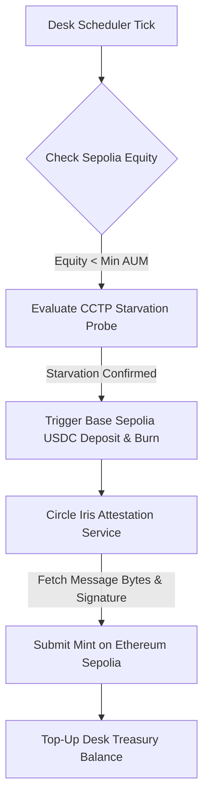

# ChronicleAI

> **Autonomous Onchain Trading Desk & Multi-Chain Intelligence Registry**  
> *Powered by KeeperHub's Execution & Reliability Stack*

[](https://keeperhub.com)
[](https://www.typescriptlang.org/)
[](https://vitejs.dev/)
[](https://expressjs.com/)
[](https://www.circle.com/en/cross-chain-transfer-protocol)

---

## Hackathon Quick Links & Verification

| Requirement | Details & Links |
| :--- | :--- |
| **Source Code Repository** | [GitHub Repository](https://github.com/zaikaman/ChronicleAI) |
| **Demonstration Video** | [Watch Video Demo](https://youtube.com) *(Demo showing agent executing onchain through KeeperHub)* |
| **Onchain ChronicleRegistry Contract (Sepolia)** | [`0xD8Deb4475a7E23E194Bc93f8739858Fb20744111`](https://sepolia.etherscan.io/address/0xD8Deb4475a7E23E194Bc93f8739858Fb20744111) *(Onchain contract where all alerts, digests, trade tickets, and payouts anchor via KeeperHub)* |
| **All Transactions & Execution Explorer** | [https://chronicle-ai-web.vercel.app/activity](https://chronicle-ai-web.vercel.app/activity) *(Public real-time dashboard displaying all execution logs, transaction hashes, CCTP rebalances, and payout receipts)* |
| **KeeperHub Stack Coverage** | **6 / 6 Surfaces Fully Implemented** (Workflows, MCP Server, x402/MPP Dual Routing, Smart Gas, Private Routing, Execution Audit Trail) |

### Verified Onchain Transactions Executed via KeeperHub Stack

| Surface / Capability | Network | Contract / Function | Real Transaction Link |
| :--- | :--- | :--- | :--- |
| **1. Daily Digest Publication** | Ethereum Sepolia | `ChronicleRegistry.publishDigest` | [`0xe25efe40...2a3c0a`](https://sepolia.etherscan.io/tx/0xe25efe406b08c852aafdca4b990d02c480707fd0c814c0bca852c679ed38d204) |
| **2. Intelligence Alert Anchor** | Ethereum Sepolia | `ChronicleRegistry.publishAlert` | [`0x1d72ba01...2b23cb`](https://sepolia.etherscan.io/tx/0x1d72ba017d1c47ea8d2b4420c044c541b9a8d068c4740b709a9a84ef12b23cb7) |
| **3. KeeperHub Operator Authorization** | Ethereum Sepolia | `ChronicleRegistry.setOperator` | [`0xc6106fb4...aa2024`](https://sepolia.etherscan.io/tx/0xc6106fb46f81c3de184875ea77757b24c3236d84615e33dea54d4b469caa2024) |
| **4. Onchain Registry Contract** | Ethereum Sepolia | `ChronicleRegistry.sol` | [`0xD8Deb447...20744111`](https://sepolia.etherscan.io/address/0xD8Deb4475a7E23E194Bc93f8739858Fb20744111) |

---

## Executive Summary

Most autonomous agent projects focus solely on **reasoning** — deciding what trade to make or what action to trigger. However, when agents attempt to bridge the "last mile" to onchain execution, they run into critical failure modes: gas price spikes, transaction stuck states, MEV sandwich attacks, lack of observability, and unhandled execution errors.

**ChronicleAI** solves the last mile completely. It is an **autonomous onchain trading desk, capital manager, and intelligence registry** built on top of **KeeperHub**. 

ChronicleAI continuously ingests onchain market signals, fuses intelligence using a tri-provider LLM fallback engine (Gemini → Groq → OpenAI), maps strategic proposals, and delegates 100% of its onchain operations — trade execution, capital rebalancing, registry publishing, and cross-chain CCTP top-ups — to **KeeperHub**.

```
                           +-------------------------------------+
                           |      ChronicleAI Agent Engine       |
                           |   Signal Fusion & Risk Reasoning    |
                           +------------------+------------------+
                                              |
                                              v
                           +-------------------------------------+
                           |      KeeperHub Execution Layer      |
                           +--------+-------------------+--------+
                                    |                   |
            +-----------------------+                   +-----------------------+
            |                       |                   |                       |
            v                       v                   v                       v
  +------------------+    +-------------------+   +------------------+    +------------------+
  |  MCP Tooling     |    |  Private Routing  |   | Smart Gas /      |    | x402 / MPP       |
  |  & Workflow      |    |  (MEV Protection) |   | Preflight Dryrun |    | Agent Payments   |
  +------------------+    +-------------------+   +------------------+    +------------------+
```

---

## Comprehensive Matrix of KeeperHub Surfaces

ChronicleAI natively integrates all six core surfaces of the KeeperHub execution stack:

| Surface | KeeperHub Capability | ChronicleAI Implementation & File Location | Functional Value |
| :--- | :--- | :--- | :--- |
| **1. Onchain Execution Layer** | Workflow Triggers & Execution Bridge | [`apps/api/src/desk/execution-bridge.ts`](file:///d:/ChronicleAI/apps/api/src/desk/execution-bridge.ts)<br>[`apps/api/src/desk/capital-manager.ts`](file:///d:/ChronicleAI/apps/api/src/desk/capital-manager.ts) | Executes desk buy/sell trades, position adjustments, and treasury top-ups through configured KeeperHub workflow IDs with zero direct key handling. |
| **2. MCP Server & Tooling** | Remote Tool Discovery & Dynamic Invocation | [`apps/api/src/services/keeperhub-mcp-client.ts`](file:///d:/ChronicleAI/apps/api/src/services/keeperhub-mcp-client.ts)<br>[`apps/api/scripts/keeperhub-stack-smoke.ts`](file:///d:/ChronicleAI/apps/api/scripts/keeperhub-stack-smoke.ts) | Connects to KeeperHub MCP Server over SSE/HTTP, dynamically listing available execution tools (`listServerTools`) with automatic REST fallback. |
| **3. x402 / MPP Agent Payments** | Dual-Protocol HTTP Settlement | [`apps/api/src/payments/x402-payment-adapter.ts`](file:///d:/ChronicleAI/apps/api/src/payments/x402-payment-adapter.ts)<br>[`apps/api/src/payments/mpp-payment-adapter.ts`](file:///d:/ChronicleAI/apps/api/src/payments/mpp-payment-adapter.ts) | Serves premium intelligence feeds & newsletter subscriptions over HTTP via auto-routing challenge selection between x402 (EIP-712 USDC permits) and MPP. |
| **4. Smart Gas & Preflight** | Simulation & Adaptive Backoff | [`apps/api/src/desk/kh-simulate-preflight.ts`](file:///d:/ChronicleAI/apps/api/src/desk/kh-simulate-preflight.ts) | Layer A preflight dry-run (`simulate: true`) runs before every strategy execution to verify revert conditions and calculate adaptive congestion pricing. |
| **5. Private Routing** | MEV Protection & Private Mempools | [`apps/api/src/services/keeperhub-private-capability.ts`](file:///d:/ChronicleAI/apps/api/src/services/keeperhub-private-capability.ts) | Directs all material transactions via Flashbots Protect RPC on Ethereum Sepolia (chain `11155111`) with strict fail-closed enforcement. |
| **6. Execution Audit Trail** | Multi-Tier Log Tracing & LLM Narrative | [`apps/api/src/desk/execution-audit.ts`](file:///d:/ChronicleAI/apps/api/src/desk/execution-audit.ts)<br>[`apps/api/src/desk/agent/failure-classifier.ts`](file:///d:/ChronicleAI/apps/api/src/desk/agent/failure-classifier.ts) | Correlates Layer A simulations, Layer B KeeperHub logs, and Layer C onchain receipts, running LLM failure classification and generating natural-language narratives. |

---

## System Architecture & End-to-End Execution Flow

### 1. Desk Strategy & Execution Cycle



### 2. Dual-Protocol Payment Auto-Routing (x402 + MPP)



### 3. Circle CCTP Cross-Chain Liquidity Rebalancing Worker



---

## Core Technical Features & Innovations

### 1. Tri-Provider LLM Fallback Architecture
To guarantee 99.99% reasoning availability, ChronicleAI implements a resilient multi-provider LLM fallback hierarchy:
- **Primary**: Google Gemini 2.5 Flash / 3.6 Flash (high-throughput reasoning)
- **Secondary**: Groq Llama-3 (ultra-low latency execution fallback)
- **Tertiary**: OpenAI GPT-4o (high-precision edge case resolution)

### 2. Autonomous Liquidity Starvation Defense (Circle CCTP)
When market volatility or trade execution depletes USDC on the primary trading chain (Ethereum Sepolia), ChronicleAI's background CCTP rebalance worker (`apps/api/src/cctp/rebalance-service.ts`) detects liquidity starvation, automatically initiating cross-chain USDC burns on Base Sepolia, fetching Circle Iris attestations, and minting fresh USDC on Sepolia to maintain trading desk operation.

### 3. Automated Kill-Safe Control Plane
The trading desk contains a multi-tier safety net (`apps/api/src/desk/kill-switch-service.ts`):
- **Health Heartbeats**: Automatic desk pause if heartbeats miss the configured threshold.
- **Fail-Closed Execution**: If any simulation or risk constraint fails, the engine halts trading and enters defense mode.
- **State Hydration**: Control plane state persists across process restarts via Supabase database tables (`desk_control_state`).

### 4. Enterprise Execution Audit Timeline
Every single trade or capital movement produces a rich, structured audit log surfaced in the frontend UI (`apps/web/src/features/desk/ExecutionAuditTimeline.tsx`):
- **Layer A**: Simulation inputs, gas pricing, and preflight dry-run outputs.
- **Layer B**: KeeperHub execution workflow ID, request payload, and response timing.
- **Layer C**: Final onchain transaction hash, block number, gas consumed, and smart gas narrative.

---

## Repository Code Map for Evaluators

For judges and AI evaluator agents inspecting source code:

| Component | File Path | Description |
| :--- | :--- | :--- |
| **KeeperHub Integration Bridge** | [`apps/api/src/desk/execution-bridge.ts`](file:///d:/ChronicleAI/apps/api/src/desk/execution-bridge.ts) | Bridges desk intents to KeeperHub workflow execution endpoints. |
| **MCP Client Discovery** | [`apps/api/src/services/keeperhub-mcp-client.ts`](file:///d:/ChronicleAI/apps/api/src/services/keeperhub-mcp-client.ts) | MCP server connection and tool listing implementation. |
| **Preflight Simulation** | [`apps/api/src/desk/kh-simulate-preflight.ts`](file:///d:/ChronicleAI/apps/api/src/desk/kh-simulate-preflight.ts) | Dry-run preflight simulator enforcing Layer A verification. |
| **x402 Payment Adapter** | [`apps/api/src/payments/x402-payment-adapter.ts`](file:///d:/ChronicleAI/apps/api/src/payments/x402-payment-adapter.ts) | Base Sepolia EIP-712 permit and USDC payment settlement. |
| **MPP Payment Adapter** | [`apps/api/src/payments/mpp-payment-adapter.ts`](file:///d:/ChronicleAI/apps/api/src/payments/mpp-payment-adapter.ts) | Micro-payment protocol challenge handler and verification. |
| **Private Mempool Capability** | [`apps/api/src/services/keeperhub-private-capability.ts`](file:///d:/ChronicleAI/apps/api/src/services/keeperhub-private-capability.ts) | Private RPC routing verification and fail-closed checks. |
| **CCTP Rebalance Service** | [`apps/api/src/cctp/rebalance-service.ts`](file:///d:/ChronicleAI/apps/api/src/cctp/rebalance-service.ts) | Circle CCTP cross-chain bridge and worker implementation. |
| **Desk Trading Agent** | [`apps/api/src/desk/agent/desk-trading-agent.ts`](file:///d:/ChronicleAI/apps/api/src/desk/agent/desk-trading-agent.ts) | LLM trading decision engine and proposal mapping. |
| **Execution Audit Engine** | [`apps/api/src/desk/execution-audit.ts`](file:///d:/ChronicleAI/apps/api/src/desk/execution-audit.ts) | Multi-tier audit trail builder and log synthesizer. |
| **All Transactions Explorer UI** | [`apps/web/src/features/activity/ActivityPage.tsx`](file:///d:/ChronicleAI/apps/web/src/features/activity/ActivityPage.tsx) | Live public dashboard displaying all onchain transactions, execution logs, CCTP rebalances, and payout receipts. |
| **Web Dashboard UI** | [`apps/web/src/features/desk/DeskStatusPage.tsx`](file:///d:/ChronicleAI/apps/web/src/features/desk/DeskStatusPage.tsx) | Live trading desk dashboard, audit timeline, and control UI. |

---

## Prerequisites & Environment Setup

### 1. Prerequisites
- **Node.js**: `v22.x`
- **pnpm**: `v10.7.1`
- **Supabase CLI**: For local database migrations / types

### 2. Environment Configuration
Copy the example environment files in `apps/api`:

```bash
cp apps/api/.env.example apps/api/.env
```

Key environment variables:
```env
# KeeperHub Credentials
KEEPERHUB_API_KEY=kh_live_...
KEEPERHUB_API_BASE_URL=https://app.keeperhub.com
KEEPERHUB_MCP_ENABLED=true
KEEPERHUB_MCP_URL=https://mcp.keeperhub.com/sse

# Mempool & Private Routing
DESK_USE_PRIVATE_MEMPOOL=true
DESK_PRIVATE_MEMPOOL_STRICT=true
REGISTRY_USE_PRIVATE_MEMPOOL=true

# AI Provider Keys
GEMINI_API_KEY=AIzaSy...
GROQ_API_KEY=gsk_...
OPENAI_API_KEY=sk-...

# Web3 & Network RPCs
RPC_URL=https://sepolia.infura.io/v3/...
X402_RPC_URL=https://sepolia.base.org
DESK_WALLET_ADDRESS=0x...
```

---

## Running ChronicleAI

### 1. Install Dependencies
```bash
pnpm install
```

### 2. Run KeeperHub Stack Smoke Test
Verify all six KeeperHub surfaces and private mempool capabilities:
```bash
pnpm --filter @chronicleai/api exec tsx scripts/keeperhub-stack-smoke.ts
```

### 3. Run Development Servers (API + Web Frontend)
```bash
pnpm dev
```
- **Web Frontend**: `http://localhost:5173`
- **API Server**: `http://localhost:3000`

### 4. Run Verification & Test Suite
```bash
# Typecheck across mono-repo
pnpm type-check

# Run unit & contract test suite
pnpm test
```

---

## License & Acknowledgments

Built for **The Last Mile: KeeperHub AI Agent Hackathon 2026**.

- Infrastructure & Execution Layer: [KeeperHub](https://keeperhub.com)
- Cross-Chain Transfers: [Circle CCTP](https://www.circle.com)
- Non-Custodial Wallets: [Para REST SDK](https://getpara.com)
