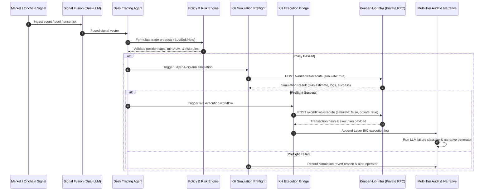
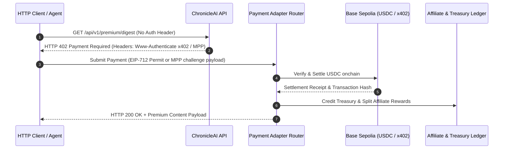
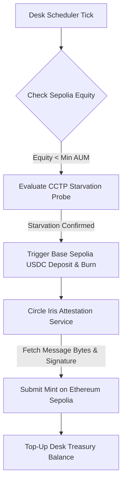

# ChronicleAI

> **Autonomous Onchain Trading Desk & Multi-Chain Intelligence Registry**  
> *Powered by KeeperHub's Execution & Reliability Stack*

[](https://keeperhub.com)
[](workflows/keeperhub)
[](README.md)
[](https://js.langchain.com/)
[](https://www.typescriptlang.org/)
[](https://vitejs.dev/)
[](https://expressjs.com/)
[](https://www.circle.com/en/cross-chain-transfer-protocol)

---

## Hackathon Quick Links & Verification

| Requirement | Details & Links |
| :--- | :--- |
| **Source Code Repository** | [GitHub Repository](https://github.com/zaikaman/ChronicleAI) |
| **Demonstration Video** | [Watch Video Demo](https://youtube.com) *(Demo showing agent executing onchain through KeeperHub)* |
| **Onchain ChronicleRegistry Contract (Sepolia)** | [`0xD8Deb4475a7E23E194Bc93f8739858Fb20744111`](https://sepolia.etherscan.io/address/0xD8Deb4475a7E23E194Bc93f8739858Fb20744111) *(Onchain contract where all alerts, digests, trade tickets, and payouts anchor via KeeperHub)* |
| **All Transactions & Execution Explorer** | [https://chronicle-ai-web.vercel.app/activity](https://chronicle-ai-web.vercel.app/activity) *(Public real-time dashboard displaying all execution logs, transaction hashes, CCTP rebalances, and payout receipts)* |
| **Hackathon Executed Transactions** |  · Real-time count of onchain transactions executed via KeeperHub during hackathon window (July 27 – Aug 13, 2026). View [Full Matrix Below](#verified-onchain-transactions-executed-via-keeperhub-stack) |
| **KeeperHub Stack Coverage** | **6 / 6 Surfaces Fully Implemented** (Workflows, MCP Server, x402/MPP Dual Routing, Smart Gas, Hybrid Private Routing & Gas Sponsorship, Execution Audit Trail)<br>*Hybrid routing: material desk & capital txs use KeeperHub private mempool (Flashbots Protect · Sepolia; wallet-paid gas — sponsorship is mutually exclusive with private route). Registry / alert / receipt writes use public mempool + KeeperHub gas sponsorship. Policy is per transaction class, not "all private or all sponsored."* |
| **Test Suite & Workflows** | **1,054 passed, 42 skipped** across 132 test files (`pnpm test`; 124 passed files, 8 skipped) · **33 workflow JSON definitions** in [`workflows/keeperhub/`](workflows/keeperhub) (**28 core + 5 optional mainnet newspaper monitors**) |

## Judge in 30 seconds

1. **Live app:** [https://chronicle-ai-web.vercel.app/activity](https://chronicle-ai-web.vercel.app/activity)
2. **Demo video:** [Watch Video Demo](https://youtube.com) *(Demo showing agent executing onchain through KeeperHub)*
3. **Golden txs (15 live transactions executed via KH):**
   - **Desk Trade (Uniswap V3 Swap via KH Private RPC):** [https://sepolia.etherscan.io/tx/0xf7c52b28894b6551bd4305085141ccca70898f969bd8ac589bf52c4bb0a3d0b6](https://sepolia.etherscan.io/tx/0xf7c52b28894b6551bd4305085141ccca70898f969bd8ac589bf52c4bb0a3d0b6) — *Private route*
   - **Yield Rotation (Aave V3 Supply via KH Smart Gas):** [https://sepolia.etherscan.io/tx/0x5a17e7b561bceb585faa45ff05f0bdabe18e216e1b40f67525cc47cf3ec0cc61](https://sepolia.etherscan.io/tx/0x5a17e7b561bceb585faa45ff05f0bdabe18e216e1b40f67525cc47cf3ec0cc61) — *Private route*
   - **Daily Digest Write:** [https://sepolia.etherscan.io/tx/0xe25efe406b08c852aafdca4b990d02c480707fd0c814c0bca852c679ed38d204](https://sepolia.etherscan.io/tx/0xe25efe406b08c852aafdca4b990d02c480707fd0c814c0bca852c679ed38d204) — *Public (Sponsorship requested)*
   - **Circle CCTP Cross-Chain Rebalance:** [https://sepolia.basescan.org/tx/0xb30984def5e87dbcf3968e30972229f1e9109afbe39338e375f8c4de7c67cec4](https://sepolia.basescan.org/tx/0xb30984def5e87dbcf3968e30972229f1e9109afbe39338e375f8c4de7c67cec4) → [https://sepolia.etherscan.io/tx/0xfeb8f1e45c61abc4bd5c0d94b9073b1447687b15469ad1171833dc0855c4497c](https://sepolia.etherscan.io/tx/0xfeb8f1e45c61abc4bd5c0d94b9073b1447687b15469ad1171833dc0855c4497c)
4. **Surfaces checklist:** 6 / 6 KeeperHub surfaces implemented (see full matrix below)
5. **Engineering Rigor:** `pnpm test` reports **1,054 passed and 42 skipped tests** across 132 test files (124 passed files, 8 skipped)
6. **KeeperHub Workflows:** **33 workflow JSON definitions** in [`workflows/keeperhub/`](workflows/keeperhub) (28 core + 5 optional mainnet newspaper monitors)

---

## How we score against The Last Mile

> *Judges score rubrics; don’t make them reverse-engineer yours.*

| Criterion | How ChronicleAI hits it | Proof |
| :--- | :--- | :--- |
| **Executes via KeeperHub** | Desk strategies + registry writes go through KH workflows | [Golden Txs](#verified-onchain-transactions-executed-via-keeperhub-stack) |
| **Surfaces** | MCP, workflows, x402/MPP, smart gas, private route, audit | [File Links](#comprehensive-matrix-of-keeperhub-surfaces) + [`smoke script`](#2-run-keeperhub-stack-smoke-test) |
| **Reliability** | Preflight dry-run, fail-closed private RPC, kill switch, retries, LLM failure classification | [Audit UI](https://chronicle-ai-web.vercel.app/desk) + [Code](apps/api/src/desk/execution-audit.ts) |
| **Real usefulness** | Autonomous trading desk + capital starvation defense (CCTP) + paid intelligence | Live [`/activity`](https://chronicle-ai-web.vercel.app/activity) |
| **Integration quality** | Monorepo architecture, automated smoke test, typed env, multi-tier audit layers | `pnpm --filter @chronicleai/api exec tsx scripts/keeperhub-stack-smoke.ts` |

---

### Verified Onchain Transactions Executed via KeeperHub Stack

| Surface / Workflow | Strategy / Action | KeeperHub Workflow JSON | Real Executed Transaction Link |
| :--- | :--- | :--- | :--- |
| **1. Desk Oracle Arbitrage** | Uniswap V3 Swap (`oracle_arb` via Private RPC) | [`desk-oracle-arb.workflow.json`](workflows/keeperhub/desk-oracle-arb.workflow.json) | [`0xf7c52b28...0a3d0b6`](https://sepolia.etherscan.io/tx/0xf7c52b28894b6551bd4305085141ccca70898f969bd8ac589bf52c4bb0a3d0b6) |
| **2. Desk Yield Rotation** | Aave V3 Supply (`rotate_yield` via KeeperHub) | [`desk-rotate-yield.workflow.json`](workflows/keeperhub/desk-rotate-yield.workflow.json) | [`0x5a17e7b5...3ec0cc61`](https://sepolia.etherscan.io/tx/0x5a17e7b561bceb585faa45ff05f0bdabe18e216e1b40f67525cc47cf3ec0cc61) |
| **3. Desk Treasury Profit Sweep** | Treasury Transfer (`sweep` via KeeperHub) | [`desk-sweep.workflow.json`](workflows/keeperhub/desk-sweep.workflow.json) | [`0x47d1f3b9...4cebeeda`](https://sepolia.etherscan.io/tx/0x47d1f3b90396e4fd63168f056d027cf0c9c8bd90949041f749bb249e4cebeeda) |
| **4. Daily Digest Publication** | `ChronicleRegistry.publishDigest` | [`chronicle-publish-digest.workflow.json`](workflows/keeperhub/chronicle-publish-digest.workflow.json) | [`0xe25efe40...2a3c0a`](https://sepolia.etherscan.io/tx/0xe25efe406b08c852aafdca4b990d02c480707fd0c814c0bca852c679ed38d204) |
| **5. Intelligence Alert Anchor** | `ChronicleRegistry.publishAlert` | [`chronicle-publish-alert.workflow.json`](workflows/keeperhub/chronicle-publish-alert.workflow.json) | [`0x1d72ba01...2b23cb`](https://sepolia.etherscan.io/tx/0x1d72ba017d1c47ea8d2b4420c044c541b9a8d068c4740b709a9a84ef12b23cb7) |
| **6. Desk Capital Topup** | Treasury Deposit (`recordCapitalMove`) | [`chronicle-record-capital-move.workflow.json`](workflows/keeperhub/chronicle-record-capital-move.workflow.json) | [`0x7aac47c6...95f224bf`](https://sepolia.etherscan.io/tx/0x7aac47c61d30b15a7cb381423731fbd61936e086c5e54402a7a3d54395f224bf) |
| **7. Onchain Trade Ticket Anchor** | `ChronicleRegistry.recordTradeTicket` | [`chronicle-publish-trade-ticket.workflow.json`](workflows/keeperhub/chronicle-publish-trade-ticket.workflow.json) | [`0xaf1c821f...a1952`](https://sepolia.etherscan.io/tx/0xaf1c821f6edbd78af9f6f63d0a982d311d5db05dc217db3787a61179ca4a1952) |
| **8. Capital Move Registry Anchor** | `ChronicleRegistry.recordCapitalMove` | [`chronicle-record-capital-move.workflow.json`](workflows/keeperhub/chronicle-record-capital-move.workflow.json) | [`0x3eeaa9ab...fe87`](https://sepolia.etherscan.io/tx/0x3eeaa9aba8aa21eb5f3b7ef387b82d66182a2d62d044ea64687f1c4841c5fe87) |
| **9. x402 Premium Receipt Anchor** | `ChronicleRegistry.recordPremiumReceipt` (x402) | [`chronicle-publish-premium-receipt.workflow.json`](workflows/keeperhub/chronicle-publish-premium-receipt.workflow.json) | [`0x9e109ac9...2d96`](https://sepolia.etherscan.io/tx/0x9e109ac9caa345206c9fb863adcb5dfe9c966df8969b434af9c5f3f7f2c62d96) |
| **10. MPP Premium Receipt Anchor** | `ChronicleRegistry.recordPremiumReceipt` (MPP) | [`chronicle-publish-premium-receipt.workflow.json`](workflows/keeperhub/chronicle-publish-premium-receipt.workflow.json) | [`0x881691e5...be4b`](https://sepolia.etherscan.io/tx/0x881691e5ce03e68524ab6ce2e4d2519d051ddc77438eb79240985ac76393be4b) |
| **11. Sponsored Watch Creation** | `ChronicleRegistry.createSponsoredWatch` | [`chronicle-create-sponsored-watch.workflow.json`](workflows/keeperhub/chronicle-create-sponsored-watch.workflow.json) | [`0xcc5eb3b6...85b2`](https://sepolia.etherscan.io/tx/0xcc5eb3b64e1ceb743e99a98525707b3594c36dfec91f1bbb497b2a4e64d785b2) |
| **12. Sponsored Report Anchor** | `ChronicleRegistry.publishSponsoredReport` | [`chronicle-publish-sponsored-report.workflow.json`](workflows/keeperhub/chronicle-publish-sponsored-report.workflow.json) | [`0x92d63e8b...bdf7`](https://sepolia.etherscan.io/tx/0x92d63e8b3912e6fc57b19637cbbb158d20fce8e801997bce6a0489c68846bdf7) |
| **13. Affiliate Payout Anchor** | `ChronicleRegistry.recordAffiliatePayout` | [`chronicle-record-payout.workflow.json`](workflows/keeperhub/chronicle-record-payout.workflow.json) | [`0xd4739e92...d7fc`](https://sepolia.etherscan.io/tx/0xd4739e92b6ae88f61d06c63cd10e22794da86f058356484f7decced41af2d7fc) |
| **14. Circle CCTP USDC Burn** | TokenMessenger `depositForBurn` | [`stablecoin-usdc-mint-burn.workflow.json`](workflows/keeperhub/stablecoin-usdc-mint-burn.workflow.json) | [`0xb30984de...cec4`](https://sepolia.basescan.org/tx/0xb30984def5e87dbcf3968e30972229f1e9109afbe39338e375f8c4de7c67cec4) |
| **15. Circle CCTP USDC Mint** | MessageTransmitter `receiveMessage` | [`stablecoin-usdc-mint-burn.workflow.json`](workflows/keeperhub/stablecoin-usdc-mint-burn.workflow.json) | [`0xfeb8f1e4...497c`](https://sepolia.etherscan.io/tx/0xfeb8f1e45c61abc4bd5c0d94b9073b1447687b15469ad1171833dc0855c4497c) |

---

## Executive Summary

Most autonomous agent projects focus solely on **reasoning** — deciding what trade to make or what action to trigger. However, when agents attempt to bridge the "last mile" to onchain execution, they run into critical failure modes: gas price spikes, transaction stuck states, MEV sandwich attacks, lack of observability, and unhandled execution errors.

**ChronicleAI** addresses the last mile for desk execution. It is an **autonomous onchain trading desk, capital manager, and intelligence registry** built on top of **KeeperHub**. 

ChronicleAI continuously ingests onchain market signals, fuses intelligence using a dual-provider LLM fallback engine powered by **LangChainJS** (Groq → OpenAI), maps strategic proposals, and delegates 100% of its onchain operations — trade execution, capital rebalancing, registry publishing, and cross-chain CCTP top-ups — to **KeeperHub**.

- **Who:** Operators / agents that need reliable onchain desk execution
- **What runs unattended:** Arb, yield rotate, sweep, CCTP top-up
- **What fails safely:** Preflight block, kill switch, private fail-closed
- **Why not DIY RPC:** MEV, gas, no audit, no payment rails

```
                           +-------------------------------------+
                           |      ChronicleAI Agent Engine       |
                           |   Signal Fusion & Risk Reasoning    |
                           +------------------+------------------+
                                              |
                                              v
                           +-------------------------------------+
                           |      KeeperHub Execution Layer      |
                           +--------+-------------------+--------+
                                    |                   |
            +-----------------------+                   +-----------------------+
            |                       |                   |                       |
            v                       v                   v                       v
  +------------------+    +-------------------+   +------------------+    +------------------+
  |  MCP Tooling     |    |  Private Routing  |   | Smart Gas /      |    | x402 / MPP       |
  |  & Workflow      |    |  (Private Mempool)|   | Preflight Dryrun |    | Agent Payments   |
  +------------------+    +-------------------+   +------------------+    +------------------+
```

---

## Comprehensive Matrix of KeeperHub Surfaces

ChronicleAI natively integrates all six core surfaces of the KeeperHub execution stack:

| Surface | KeeperHub Capability | ChronicleAI Implementation & File Location | Functional Value |
| :--- | :--- | :--- | :--- |
| **1. Onchain Execution Layer** | Workflow Triggers & Execution Bridge | [`apps/api/src/desk/execution-bridge.ts`](apps/api/src/desk/execution-bridge.ts)<br>[`apps/api/src/desk/capital-manager.ts`](apps/api/src/desk/capital-manager.ts) | Executes desk buy/sell trades, position adjustments, and treasury top-ups through configured KeeperHub workflow IDs with zero direct key handling. |
| **2. MCP Server & Tooling** | Remote Tool Discovery & Dynamic Invocation | [`apps/api/src/services/keeperhub-mcp-client.ts`](apps/api/src/services/keeperhub-mcp-client.ts)<br>[`apps/api/scripts/keeperhub-stack-smoke.ts`](apps/api/scripts/keeperhub-stack-smoke.ts) | Connects to KeeperHub MCP Server over SSE/HTTP, dynamically listing available execution tools (`listServerTools`) with automatic REST fallback. |
| **3. x402 / MPP Agent Payments** | Dual-Protocol HTTP Settlement | [`apps/api/src/payments/x402-payment-adapter.ts`](apps/api/src/payments/x402-payment-adapter.ts)<br>[`apps/api/src/payments/mpp-payment-adapter.ts`](apps/api/src/payments/mpp-payment-adapter.ts) | Serves premium intelligence feeds & newsletter subscriptions over HTTP via auto-routing challenge selection between x402 (EIP-712 USDC permits) and MPP. |
| **4. Smart Gas & Preflight** | Simulation & Adaptive Backoff | [`apps/api/src/desk/kh-simulate-preflight.ts`](apps/api/src/desk/kh-simulate-preflight.ts) | Layer A preflight dry-run (`simulate: true`) runs before every strategy execution to verify revert conditions and calculate adaptive congestion pricing. |
| **5. Hybrid Routing & Gas Sponsorship** | Private desk path and public treasury/registry path | [`apps/api/src/services/keeperhub-private-capability.ts`](apps/api/src/services/keeperhub-private-capability.ts)<br>[`apps/api/src/services/routing-metadata.ts`](apps/api/src/services/routing-metadata.ts)<br>`workflow usePrivateMempool flags` | Desk/kill-switch: private + strict (Private route). Treasury/revenue transfers and registry writes: public, with sponsorship preferred where supported. Audit badges show Private route vs Public. |
| **6. Execution Audit Trail** | Multi-Tier Log Tracing & LLM Narrative | [`apps/api/src/desk/execution-audit.ts`](apps/api/src/desk/execution-audit.ts)<br>[`apps/api/src/desk/agent/failure-classifier.ts`](apps/api/src/desk/agent/failure-classifier.ts) | Correlates Layer A simulations, Layer B KeeperHub logs, and Layer C onchain receipts, running LLM failure classification and generating natural-language narratives. |

---

### Execution Routing Policy

| Tx class | KeeperHub route | Gas | Badge |
|----------|-----------------|-----|-------|
| Desk strategies (`oracle_arb`, `rotate_yield`, …) | Private mempool (`strict`) | Wallet ETH | Private route |
| Kill-switch residual | Private mempool (`strict`, always) | Wallet ETH | Private route |
| Treasury/revenue transfer | Public via KeeperHub workflow | Wallet ETH | Public route |
| Registry publish / digests / receipts / sponsored watches | Public mempool | Sponsorship preferred | Public (Sponsorship requested) |

*Private routing and gas sponsorship are **mutually exclusive on the same tx**. Chronicle keeps private routing for desk/kill-switch execution and uses the public KeeperHub path for treasury/revenue transfers and registry writes.*

---

## System Architecture & End-to-End Execution Flow

### 1. Desk Strategy & Execution Cycle



### 2. Dual-Protocol Payment Auto-Routing (x402 + MPP)



### 3. Circle CCTP Cross-Chain Liquidity Rebalancing Worker



---

## Core Technical Features & Innovations

### 1. Dual-Provider LLM Fallback Architecture (LangChainJS)
ChronicleAI implements a resilient multi-provider LLM fallback hierarchy built on **LangChainJS**:
- **Primary**: Groq Qwen 3.6-27b (ultra-low latency, round-robin multi-key rotation with automatic per-key rate-limit fallback)
- **Secondary**: OpenAI GPT-5-Nano (high-precision edge case resolution when all Groq keys are exhausted)

### 2. Autonomous Liquidity Starvation Defense (Circle CCTP)
When market volatility or trade execution depletes USDC on the primary trading chain (Ethereum Sepolia), ChronicleAI's background CCTP rebalance worker (`apps/api/src/cctp/rebalance-service.ts`) detects liquidity starvation, automatically initiating cross-chain USDC burns on Base Sepolia, fetching Circle Iris attestations, and minting fresh USDC on Sepolia to maintain trading desk operation.

### 3. Automated Kill-Safe Control Plane
The trading desk contains a multi-tier safety net (`apps/api/src/desk/kill-switch-service.ts`):
- **Health Heartbeats**: Automatic desk pause if heartbeats miss the configured threshold.
- **Fail-Closed Execution**: If any simulation or risk constraint fails, the engine halts trading and enters defense mode.
- **State Hydration**: Control plane state persists across process restarts via Supabase database tables (`desk_control_state`).

### 4. Enterprise Execution Audit Timeline
Every single trade or capital movement produces a rich, structured audit log surfaced in the frontend UI (`apps/web/src/features/desk/ExecutionAuditTimeline.tsx`):
- **Layer A**: Simulation inputs, gas pricing, and preflight dry-run outputs.
- **Layer B**: KeeperHub execution workflow ID, request payload, and response timing.
- **Layer C**: Final onchain transaction hash, block number, gas consumed, and smart gas narrative.

---

## Repository Code Map for Evaluators

For judges and AI evaluator agents inspecting source code:

| Component | Source File Path | Live Web Route & Description |
| :--- | :--- | :--- |
| **KeeperHub Integration Bridge** | [`apps/api/src/desk/execution-bridge.ts`](apps/api/src/desk/execution-bridge.ts) | Bridges desk intents to KeeperHub workflow execution endpoints. |
| **MCP Client Discovery** | [`apps/api/src/services/keeperhub-mcp-client.ts`](apps/api/src/services/keeperhub-mcp-client.ts) | MCP server connection and tool listing implementation. |
| **Preflight Simulation** | [`apps/api/src/desk/kh-simulate-preflight.ts`](apps/api/src/desk/kh-simulate-preflight.ts) | Dry-run preflight simulator enforcing Layer A verification. |
| **x402 Payment Adapter** | [`apps/api/src/payments/x402-payment-adapter.ts`](apps/api/src/payments/x402-payment-adapter.ts) | Base Sepolia EIP-712 permit and USDC payment settlement. |
| **MPP Payment Adapter** | [`apps/api/src/payments/mpp-payment-adapter.ts`](apps/api/src/payments/mpp-payment-adapter.ts) | Micro-payment protocol challenge handler and verification. |
| **Hybrid Routing & Gas Sponsorship** | [`apps/api/src/services/keeperhub-private-capability.ts`](apps/api/src/services/keeperhub-private-capability.ts)<br>[`apps/api/src/services/routing-metadata.ts`](apps/api/src/services/routing-metadata.ts) | Private RPC routing verification for desk trades + gas sponsorship metadata for public registry. |
| **CCTP Rebalance Service** | [`apps/api/src/cctp/rebalance-service.ts`](apps/api/src/cctp/rebalance-service.ts) | Circle CCTP cross-chain bridge and worker implementation. |
| **Desk Trading Agent** | [`apps/api/src/desk/agent/desk-trading-agent.ts`](apps/api/src/desk/agent/desk-trading-agent.ts) | LLM trading decision engine and proposal mapping. |
| **Execution Audit Engine** | [`apps/api/src/desk/execution-audit.ts`](apps/api/src/desk/execution-audit.ts) | Multi-tier audit trail builder and log synthesizer. |
| **All Transactions Explorer UI** | [`apps/web/src/features/activity/ActivityPage.tsx`](apps/web/src/features/activity/ActivityPage.tsx) | Live at [`/activity`](https://chronicle-ai-web.vercel.app/activity) — Public real-time dashboard displaying all execution logs, transaction hashes, CCTP rebalances, and payout receipts. |
| **Desk Control & Audit UI** | [`apps/web/src/features/desk/DeskStatusPage.tsx`](apps/web/src/features/desk/DeskStatusPage.tsx) | Live at [`/desk`](https://chronicle-ai-web.vercel.app/desk) — Live trading desk status, preflight simulation dry-run timeline, and kill switch controls. |
| **Alerts & Registry Proof UI** | [`apps/web/src/features/alerts/AlertsPage.tsx`](apps/web/src/features/alerts/AlertsPage.tsx) | Live at [`/alerts`](https://chronicle-ai-web.vercel.app/alerts) — Onchain intelligence stream with links to target digests and registry contract verification. |
| **Paid Intelligence & x402/MPP UI** | [`apps/web/src/features/premium/PremiumPage.tsx`](apps/web/src/features/premium/PremiumPage.tsx) | Live at [`/premium`](https://chronicle-ai-web.vercel.app/premium) — Agent-to-agent payment gates, EIP-712 permit submissions, and sponsored watch feeds. |
| **Affiliate Rewards UI** | [`apps/web/src/features/affiliates/AffiliatePage.tsx`](apps/web/src/features/affiliates/AffiliatePage.tsx) | Live at [`/affiliates`](https://chronicle-ai-web.vercel.app/affiliates) — Onchain affiliate tracking, performance metrics, and automated payout receipts. |

---

## Prerequisites & Environment Setup

### 1. Prerequisites
- **Node.js**: `v22.x`
- **pnpm**: `v10.7.1`
- **Supabase CLI**: For local database migrations / types

### 2. Environment Configuration
Copy the example environment files in `apps/api`:

```bash
cp apps/api/.env.example apps/api/.env
```

Key environment variables:
```env
# KeeperHub Credentials
KEEPERHUB_API_KEY=kh_live_...
KEEPERHUB_API_BASE_URL=https://app.keeperhub.com
KEEPERHUB_MCP_ENABLED=true
KEEPERHUB_MCP_URL=https://mcp.keeperhub.com/sse

# Mempool & Hybrid Routing
DESK_USE_PRIVATE_MEMPOOL=true
DESK_PRIVATE_MEMPOOL_STRICT=true
REGISTRY_USE_PRIVATE_MEMPOOL=false # false = public mempool + KeeperHub gas sponsorship

# AI Provider Keys (Groq → OpenAI fallback; Gemini removed)
GROQ_API_KEY=gsk_...
# Optional additional Groq keys for round-robin rotation:
# GROQ_API_KEY_2=gsk_...
# GROQ_API_KEY_3=gsk_...
OPENAI_API_KEY=sk-...

# Web3 & Network RPCs
RPC_URL=https://sepolia.infura.io/v3/...
X402_RPC_URL=https://sepolia.base.org
DESK_WALLET_ADDRESS=0x...
```

---

## Running ChronicleAI

### 1. Install Dependencies
```bash
pnpm install
```

### 2. Run KeeperHub Stack Smoke Test
Verify all six KeeperHub surfaces and private mempool capabilities:
```bash
pnpm --filter @chronicleai/api exec tsx scripts/keeperhub-stack-smoke.ts
```

### 3. Run Development Servers (API + Web Frontend)
```bash
pnpm dev
```
- **Web Frontend**: `http://localhost:5173`
- **API Server**: `http://localhost:3000`

### 4. Run Verification & Test Suite
```bash
# Typecheck across mono-repo
pnpm type-check

# Run unit & contract test suite
pnpm test
```

---

## License & Acknowledgments

Built for **The Last Mile: KeeperHub AI Agent Hackathon 2026**.

- Infrastructure & Execution Layer: [KeeperHub](https://keeperhub.com)
- Agent Framework: [LangChainJS](https://js.langchain.com)
- Cross-Chain Transfers: [Circle CCTP](https://www.circle.com)
- Non-Custodial Wallets: [Para REST SDK](https://getpara.com)
